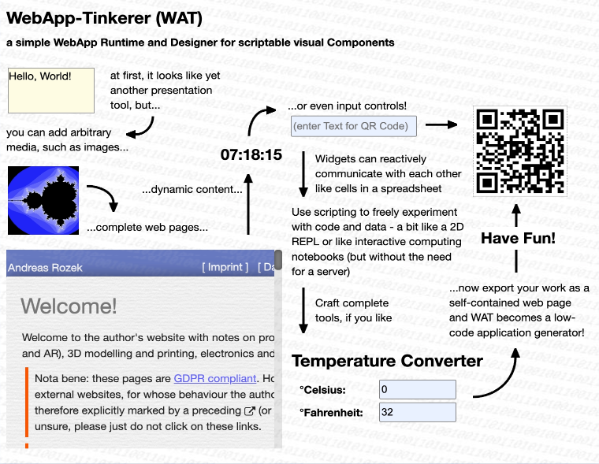

# WebApp Tinkerer (WAT)

**Design, script and publish web apps the way HyperCard once let you build Mac applications — by directly manipulating the thing you're building, not by writing boilerplate.**

> 🚧 **Status:** WAT is under active, continuous development. Core concepts (Applets, Pages, Widgets, Behaviors, Scripts) are stable, but individual widget properties and API details may still change.



[Live Demo](https://rozek.github.io/webapp-tinkerer/tools/WAT-AppletManager.html)

## Table of contents

- [What is WebApp Tinkerer?](#what-is-webapp-tinkerer)
- [Inspired by HyperCard](#inspired-by-hypercard)
- [How WAT differs from other app builders](#how-wat-differs-from-other-app-builders)
- [Core concepts](#core-concepts)
- [The two tools](#the-two-tools)
- [Designing an Applet](#designing-an-applet)
- [Built-in Widgets](#built-in-widgets)
- [Writing Scripts](#writing-scripts)
- [Building custom Behaviors](#building-custom-behaviors)
- [Experimenting live](#experimenting-live)
- [Exporting and publishing](#exporting-and-publishing)
- [Where your Applets live](#where-your-applets-live)
- [Driving WAT with an AI assistant](#driving-wat-with-an-ai-assistant)
- [API reference for WAT Scripts](#api-reference-for-wat-scripts)
- [Built with](#built-with)
- [License](#license)

## What is WebApp Tinkerer?

WebApp Tinkerer (WAT) is a browser-based tool for building interactive web applications ("**Applets**") by direct manipulation: you drag widgets onto a page, configure them in an inspector, attach small scripts where behavior is needed, and export the result as a self-contained web page — no build step, no framework to learn, no server required.

It targets the same audience HyperCard once did: people who want to turn an idea into a working, interactive application without first becoming a professional web developer — while still giving professional developers a real, unrestricted scripting language (JavaScript) and a real, inspectable output (plain HTML/JS) rather than a black box.

## Inspired by HyperCard

WAT's object model is a deliberate, modernized echo of HyperCard's:

| HyperCard | WAT | role |
|---|---|---|
| Stack | **Applet** | the whole application/document |
| Card | **Page** | one screen/view inside the Applet |
| Button, Field, … | **Widget** | a visual element on a Page |
| Script (HyperTalk), attached to any object | **Script** (JavaScript), attached to any Applet/Page/Widget | logic local to one object |
| XCMD / XFCN (native, compiled plug-ins) | **Behavior** (plain JavaScript, no native code) | reusable, installable widget/page/applet types |
| "Stand-alone application" (built with a separate utility) | exported **standalone Web App** (a single HTML file) | shareable, runnable result |

Just like HyperCard let you "browse" a stack and switch into "edit" mode on the very same card, WAT lets you flip an Applet between an **interactive** mode (it behaves exactly like the finished app) and a **layout** mode (you can select, drag, resize and configure widgets) — without ever leaving the page you're working on.

## How WAT differs from other app builders

Compared to today's low-code/no-code platforms (Bubble, Glide, Retool, Webflow, …), WAT makes different trade-offs, closer to HyperCard's spirit than to a SaaS product:

- **No server, no account, no vendor lock-in.** The Designer itself is a web app that runs entirely in your browser; Applets are stored locally (via `localForage`/IndexedDB) and exported as plain, portable HTML files you own outright.
- **Real code, not blocks.** Every Script and every Behavior is genuine JavaScript, run without a sandbox — you can use `fetch`, dynamic `import()`, or any browser API a normal web page could use.
- **Lightweight, inspectable output.** An exported Applet ("Web App without Designer") depends only on the small WAT Runtime plus a handful of focused libraries (Preact/htm, Hyperactiv, nanoid, `localForage`) — no Designer code, no heavyweight framework, no bundler-generated cruft.
- **Behaviors instead of native plug-ins.** Where HyperCard needed compiled XCMDs/XFCNs to extend its vocabulary of objects, WAT's Behaviors are ordinary scripts with a name and a category — written the same way as any other Script, shareable as JSON, and they travel with the Applet that uses them.

## Core concepts

- **Applet** — the top-level document; contains one or more Pages and can carry its own Script and its own custom Behaviors.
- **Page** — one screen inside an Applet; contains Widgets; can carry its own Script.
- **Widget** — a single visual element on a Page (a button, text field, image, list, …); its look, its default behavior *and* its configurable properties come from its **Behavior**.
- **Behavior** — a named, reusable script of category `applet`, `page` or `widget` (e.g. `native_controls.Button`) that defines what a kind of Applet/Page/Widget looks like and does. WAT ships a set of *intrinsic* (built-in) Behaviors; you can add your own.
- **Script** — a small piece of JavaScript attached directly to one particular Applet, Page or Widget instance, layered *on top of* whatever its Behavior already provides.

## The two tools

WAT ships as two thin HTML pages that both load the same Runtime and Designer libraries:

- **`tools/WAT-AppletManager.html`** — the launcher: lists every Applet you've created (persisted locally in the browser), and lets you create, rename, duplicate or delete one. Opening an Applet hands off to the Developer tool.
- **`tools/WAT-Developer.html`** — the design & test surface for a single Applet, opened as `WAT-Developer.html?name=YourApplet` (plus optional sizing parameters such as `width`, `height`, `min-width`, `max-width`, `center`, `with-mobile-frame`, `expected-orientation` — handy for previewing at a fixed viewport, e.g. to simulate a phone).

Both are plain static HTML — you can host them yourself (e.g. via GitHub Pages, as in the [Live Demo](https://rozek.github.io/webapp-tinkerer/tools/WAT-AppletManager.html)) or open them locally.

## Designing an Applet

Inside the Developer tool, a small floating button opens the **Designer overlay**, which adds two panels on top of your running Applet:

- **Toolbox** — create new Pages or Widgets by picking a Behavior from a palette (grouped by category, e.g. `basic_controls`, `native_controls`, `other_controls`, plus any custom categories of your own), reorder/duplicate/delete Pages, undo/redo, export, print, take a screenshot, and toggle **Layout mode**.
- **Inspector** — a tabbed panel with a configuration pane for the Applet, the current Page, and the currently selected Widget(s): name, description, Behavior (fixed once a Widget is created), Behavior-specific configurable properties, and — for widgets — geometry (position, size, anchors) and visibility/enabling.

**Layout mode** is the "edit" counterpart to HyperCard's card editing: while it's on, clicks select/drag/resize widgets (with a lasso for multi-select and snapping guides) instead of reaching the widgets themselves. Turn it off and the very same Page behaves exactly like the finished app — this is also how you try out what you've built without exporting anything (see [Experimenting Live](#experimenting-live)).

## Built-in Widgets

Widgets get their look and default behavior from an intrinsic **widget Behavior**, grouped by category:

| category | Widgets |
|---|---|
| `basic_controls` | `plain_Widget`, `Outline` (a grouping container), `WidgetPane`, `TextView`, `HTMLView`, `MarkdownView`, `ImageView`, `SVGView`, `WebView`, `TitleView`, `SubtitleView`, `LabelView`, `FineprintView`, `Icon`, `StraightArrow`, `CurvedArrow`, `madeWithWAT` |
| `native_controls` | `Button`, `Checkbox`, `Radiobutton`, `Gauge`, `Progressbar`, `Slider`, `TextlineInput`, `PasswordInput`, `NumberInput`, `PhoneNumberInput`, `EMailAddressInput`, `URLInput`, `TimeInput`, `DateTimeInput`, `DateInput`, `WeekInput`, `MonthInput`, `FileInput`, `PseudoFileInput`, `FileDropArea`, `SearchInput`, `ColorInput`, `DropDown`, `PseudoDropDown`, `TextInput` |
| `other_controls` | `FlatListView`, `NestedListView`, `TextlineTab`, `IconTab`, `QRCodeView`, `ChatView`, `KanbanBoard`, `CodeEditor`, `RichTextEditor`, `Spreadsheet`, `DrawingEditor`, `BitmapEditor`, `stickyTextNote`, `stickyHTMLNote`, `stickyMarkdownNote` |

Only Widgets have intrinsic Behaviors; Applets and Pages always use custom (user-authored) ones, if any.

## Writing Scripts

Every Applet, Page and Widget can carry its own Script, attached via the **Script Editor** dialog (reachable from the Toolbox for the current scope: Applet / visited Page / selected Widget(s)). A Script is plain JavaScript; edits are staged and only take effect once you click the checkmark to *apply* them — a failed script shows its error right in the dialog instead of silently breaking the Applet.

A minimal example — a Script on a `Button` widget named `IncrementButton` that increases a counter shown by another widget:

```js
// Script on widget "IncrementButton"
onReady(() => {
  const Counter = me.Page.WidgetNamed('CounterDisplay')
  on('click', () => {
    Counter.Value = (Counter.Value || 0) + 1
  })
})
```

See the [API reference](#api-reference-for-wat-scripts) below for everything a Script can use.

## Building custom Behaviors

When a Script isn't reusable enough — you want the same custom widget type in several places, or across several Applets — turn it into a **Behavior**: open the Behavior Browser in the Inspector, pick a category (`applet`, `page` or `widget`), give it a name (e.g. `my_widgets.Counter`), and edit its script in the **Behavior Editor** (the same apply/discard workflow as the plain Script Editor). Your new Behavior then shows up in the Toolbox's palette right next to the built-in ones, under its own category group.

A sketch of what a widget Behavior script looks like (illustrative, based on how intrinsic widgets are built):

```js
// Behavior "my_widgets.Counter" (category: widget)
if (BehaviorIsNew) {
  my.configurableProperties = ['Label']       // shown in the Inspector
}

Object.assign(me, {
  get Value ()  { return this._Value || 0 },
  set Value (v) { this._Value = v; me.on('Value')?.(v) },
  increment ()  { me.Value = me.Value + 1 },
})

onRender(() => html`
  <button onClick=${() => me.increment()}>
    ${my.Label || 'Count'}: ${me.Value}
  </button>
`)
```

A widget Behavior can also declare the size a new Widget should get when it's dropped from the Toolbox: add a `DefaultSize` pragma anywhere in the Behavior script, as a comment of the form `/**** DefaultSize <width>x<height> ****/` (or `// DefaultSize: <width>x<height>`), e.g. `/**** DefaultSize 80x30 ****/`. If present, the Designer uses that size (instead of its generic 30×30px fallback) whenever you create a Widget with that Behavior; it has no effect on Widgets that already exist.

Behaviors you no longer use can be deleted; intrinsic ones cannot be renamed or removed. A Behavior set can be exported/imported independently as JSON, and — because it's stored on the Applet itself — travels along whenever that Applet is exported or shared.

## Experimenting live

There's no separate "sandbox" or mock-data mode — and you don't need one: since Layout mode is just an overlay, switching it off turns your work-in-progress Page into the real, live Applet, with real widgets firing real events and real Scripts running. Tinker with data, click things, watch Scripts react, then flip Layout mode back on to adjust — exactly the "browse ⇄ edit" loop HyperCard was built around.

## Exporting and publishing

The Toolbox's export function offers several scopes and formats:

- **JSON exports** — the selected Behavior, the whole Applet, the active/selected Page(s), the selected Widget(s), an "Applet Design" (like the full Applet, but without its Scripts), or the raw Applet Script as a `.js` file. Any of these can later be imported back — WAT recognizes what kind of thing a file contains and merges or replaces accordingly.
- **Standalone Web App** — generates a complete, ready-to-host HTML file embedding your Applet's serialized definition. Choose:
  - *without Designer* — the lightweight, end-user-facing result: only the WAT Runtime (+ `localForage` and the shared libraries) is included, no editing UI.
  - *with Designer* — the same app, but still end-user editable/tinkerable after publishing.
  - *from selected Widget* — turns a single Widget (or an `Outline` group of widgets) into its own small standalone app.
- **Screenshot** and **Print** — capture the current Applet view as an image, or send it to the browser's print dialog.

## Where your Applets live

Everything you build is auto-saved locally in your browser (via `localForage`/IndexedDB) as you go, keyed by the Applet's name — that's what lets the Applet Manager list your work and what lets the Developer tool reopen exactly where you left off. You can explicitly discard this local backup and revert to whatever version is embedded in the HTML file itself.

## Driving WAT with an AI assistant

An Applet runs entirely inside your browser tab, with no server of its own — so there's normally no way for an external process to reach it. [**WAT-AI-Broker**](https://github.com/rozek/wat-ai-broker) closes that gap: a small, locally-run [MCP](https://modelcontextprotocol.io) server that sits between an MCP-capable AI assistant (Claude, …) and the WAT tab you have open, forwarding tool calls in both directions in real time.

Once connected, the assistant can do essentially everything you can do by hand in the Designer — list and inspect Pages/Widgets, read and change properties, add/duplicate/delete/reorder Pages and Widgets, set geometry, manage Behaviors (list, read, (re)script, rename, delete, find usages), get/set Scripts and read error reports, read/write a Widget's `Value`, evaluate expressions live in the running Applet, open/close overlays and dialogs, and take a screenshot — all against the very Applet you're looking at (carefully, even while you're still working in the same tab).

Getting it running, in short:

1. **Run the broker** — clone it and start it once with a shared access token:
   ```bash
   git clone https://github.com/rozek/wat-ai-broker.git
   cd wat-ai-broker && npm install && npm run build
   WAT_ACCESS_TOKEN='your-secret-token' npm start
   ```
2. **Connect WAT to it** — in the Designer's Toolbox, click the ⚙ (Settings) icon and enter the broker's WebSocket URL (`ws://localhost:3461/wat` by default) plus the same access token, then *Apply*.
3. **Point your MCP client at it** — e.g. add an MCP server for `http://127.0.0.1:3460/mcp` in Claude Code / Claude Desktop or any other MCP-capable AI client of your choice (the broker's README also covers a stdio bridge via `mcp-remote` for clients without HTTP transport).
4. *(recommended)* **Install the two companion Agent Skills** bundled with the broker (`wat-ai-broker`, `wat-reference`) — they teach the assistant the addressing conventions and the full widget/property reference, so it writes correct `widget_add`/`widget_patch`/`script_set` calls right away instead of probing the Applet first.

See the [WAT-AI-Broker README](https://github.com/rozek/wat-ai-broker#readme) for full configuration options, the complete list of tools, and security notes.

## API reference for WAT Scripts

Every Script — whether attached directly to an Applet/Page/Widget, or defined as a Behavior — is compiled as an `async function` with the same fixed parameter list:

```js
async (me, my, html, reactively, on, onReady, onRender, onMount, onUpdate, onUnmount, onValueChange, installStylesheet, BehaviorIsNew) => { ... }
```

| parameter | what it is |
|---|---|
| `me`, `my` | both refer to the very Applet/Page/Widget the script runs on (the same object, passed twice — `me` reads naturally in calls like `me.increment()`, `my` in declarations like `my.configurableProperties = [...]`). Use it to read/write built-in properties (`Value`, geometry, `Enabling`, …) and to attach your own methods/properties with `Object.assign(me, {...})`. |
| `html` | a tagged-template function (from `htm`/Preact) for describing what to render — see [Rendering](#rendering). |
| `reactively(fn)` | runs `fn` once immediately, then automatically re-runs it whenever any reactive value it read (e.g. another widget's `Value`) changes. All registrations are cleared and rebuilt whenever the script itself is re-applied. |
| `on`, `onReady`, `onRender`, `onMount`, `onUpdate`, `onUnmount`, `onValueChange` | register (or read) a named callback — see [Events & lifecycle](#events--lifecycle). The last six are just shorthands for `on('ready', …)`, `on('render', …)`, `on('mount', …)`, `on('update', …)`, `on('unmount', …)`, `on('Value', …)`. |
| `installStylesheet(cssText)` | injects (or replaces) a `<style>` block for this widget (or, in a Behavior, shared once per Behavior) — use it for CSS your `html` markup depends on. |
| `BehaviorIsNew` | `true` only the first time a Behavior script runs for a given Applet — handy for one-time setup (e.g. declaring `configurableProperties`). Always `false` for a plain, non-Behavior script. |

Scripts run with full, unrestricted access to normal browser globals (`window`, `document`, `fetch`, dynamic `import()`, …) — there is no sandbox, just this fixed set of convenience parameters injected on top.

### Rendering

`html` lets you describe a widget's appearance with plain template literals (no build step, no JSX compiler):

```js
onRender(() => html`
  <button disabled=${me.Enabling === false} onClick=${() => on('click')()}>
    ${me.Label}
  </button>
`)
```

Whatever `onRender`'s callback returns is what gets drawn whenever the widget (re-)renders.

### Reactivity

```js
reactively(() => {
  console.log('the sensor value changed to', Sensor.Value)
})
```

Anything read inside the callback that's a tracked/reactive value (such as another widget's `Value`) causes the callback to automatically run again on the next change — no manual subscribe/unsubscribe needed.

### Events & lifecycle

`on(name)` / `on(name, fn)` is a single named callback slot per Applet/Page/Widget — not a multi-listener event bus. Calling `on(name, fn)` replaces whatever was registered under `name` before; calling `on(name)` with no second argument returns (and, where the runtime does so itself, invokes) whatever is currently registered.

Names used throughout WAT:

| name | fired when |
|---|---|
| `ready` | the script has finished its first run and the object is ready to use |
| `render` | the object is about to be (re-)rendered (this is what `onRender` sets) |
| `mount` | the object has just been inserted into the page |
| `update` | the object has just been re-rendered after already being mounted |
| `unmount` | the object is about to be removed from the page |
| `Value` | the object's `Value` property was changed (this is what `onValueChange` sets) |
| `click`, `double-click` | the user clicked / double-clicked an interactive widget |
| `input` | the user changed a text/number/date/color/file/slider input |
| `blur` | a text-like input lost focus |
| `drop`, `drop-error` | a file was (successfully/unsuccessfully) dropped onto a drop area |
| `selection-change`, `item-selected`, `item-deselected` | a list-like widget's selection changed |
| `render-item` | a list widget asks how to render one of its items |

Since intrinsic widgets themselves call e.g. `on('click')(Event)` to find out what to do, attaching your own `on('click', fn)` in a Script is exactly how you make a built-in widget *do* something.

### Talking to other Widgets, Pages and the Applet

Every Widget knows its Page (`me.Page`) and, through it, its Applet (`me.Applet`); every Page knows its Applet (`me.Applet`) directly.

```js
me.Page.WidgetNamed('SomeWidget')     // undefined if there's no such widget
me.Page.existingWidget('SomeWidget')  // throws if there's no such widget
me.Page.namedWidgets                  // { name: Widget, ... } for the whole page
me.Applet.PageNamed('SomePage')
me.Applet.PageAt(0)
me.Applet.WidgetAtPath('SomePage/SomeContainer/SomeWidget')
me.Applet.WidgetsWithBehavior('native_controls.Checkbox')  // e.g. to reset all checkboxes at once
me.Applet.PagesWithBehavior('my_pages.SettingsPage')
```

With a reference to another Widget in hand, you can:

- **read or write its value** — `OtherWidget.Value`, `OtherWidget.Value = x` — and react to changes with `OtherWidget.on('Value', fn)` (from *your* script; the widget's own script can use `onValueChange` for the same thing);
- **call any method its own script or Behavior attached to it** — e.g. `OtherWidget.increment()` if its Behavior defined one (as in the [Behavior example](#building-custom-behaviors) above);
- **trigger its interactive behavior** — e.g. `OtherWidget.on('click')()`.

There's no separate "send a message" primitive beyond this — direct property/method access plus the `Value`/event mechanism *is* the inter-widget communication model.

### Defining Behaviors programmatically

Behaviors are normally authored through the Behavior Editor (see [above](#building-custom-behaviors)), but the underlying model is simply: a Behavior is a Script registered under a `Category` (`'applet' | 'page' | 'widget'`) and a dotted `Name` (e.g. `my_widgets.Counter`), stored on the Applet itself — which is why custom Behaviors are automatically included whenever that Applet is exported. Intrinsic Behaviors (the `basic_controls.*`, `native_controls.*` and `other_controls.*` ones listed [above](#built-in-widgets)) cannot be renamed, replaced or removed.

## Built with

- [Preact](https://preactjs.com) + [`htm`](https://github.com/developit/htm) — tagged-template rendering, no JSX build step
- [Hyperactiv](https://github.com/elbywan/hyperactiv) — the reactivity engine behind `reactively`
- [`javascript-interface-library`](https://github.com/rozek/javascript-interface-library) (JIL)
- [`svelte-coordinate-conversion`](https://github.com/rozek/svelte-coordinate-conversion) / [`svelte-touch-to-mouse`](https://github.com/rozek/svelte-touch-to-mouse)
- [`nanoid`](https://github.com/ai/nanoid)
- [`marked`](https://github.com/markedjs/marked) + `marked-katex-extension` + `marked-highlight` + [`highlight.js`](https://highlightjs.org) + [KaTeX](https://katex.org) — for `MarkdownView` (math must be set off by whitespace/punctuation around `$...$`/`$$...$$`, otherwise it is left as plain text)
- [`localForage`](https://github.com/localForage/localForage) — local persistence of your Applets
- [`es-module-shims`](https://github.com/guybedford/es-module-shims) — import maps in older browsers

## License

[MIT License](LICENSE.md)
